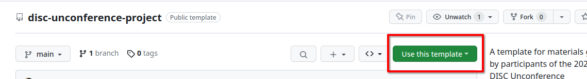
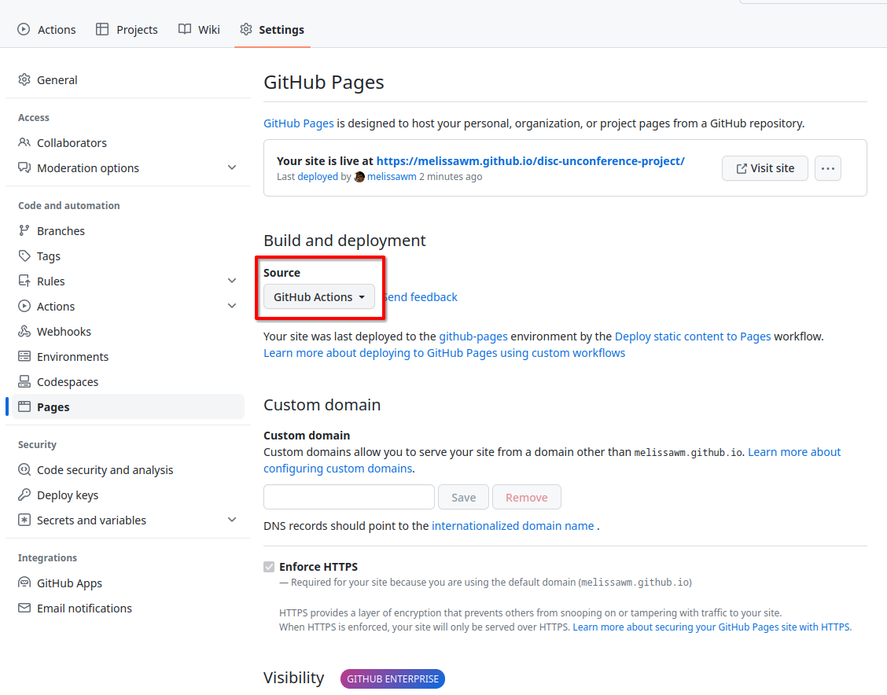

# disc-unconference-project
A template for materials generated by participants of the 2023 NumFOCUS DISC Unconference

## How to use this repository

This repository is meant to be [forked](https://docs.github.com/en/get-started/quickstart/fork-a-repo) and edited so that you have a starting point when creating your own project. All instructions below are meant to be executed _on your own fork_, so that you have a copy of the template that you can adjust to your needs.

Alternatively, you can click the `Use this template` button in the GitHub web interface for this repository:



## How to build and visualize these documents

This repository sets up a [JupyterBook](https://jupyterbook.org/en/stable/start/your-first-book.html). All your content should be markdown files stored in the `my-project` folder. You can rename this folder to your liking.

Make sure to update the project name, repository URL and author information in `_config.yml`.

### Building locally

To build the book locally, you need to have [JupyterBook installed](https://jupyterbook.org/en/stable/install.html). You can use either `pip` or `conda` to install this and other requirements for your book by running

```bash
pip install -r requirements.txt
```

or

```bash
conda create -f environment.yml
conda activate project
```

Then, run

```bash
jupyter-book build my-project
```

to build the book. You can then open the generated `my-project/_build/html/index.html` file in your browser to view the book.

### GitHub pages

This repository comes with a [pre-defined GitHub pages setup](https://github.com/melissawm/disc-unconference-project/blob/main/.github/workflows/pages.yml). To enable it, go to the repository settings, scroll down to the GitHub pages section in the left sidebar, and select the `GitHub Actions` source for deployment: 



You also need to edit the `pages.yml` file if you rename the project or change the folder where the project is stored.

You can then access your site at `https://<your-github-username>.github.io/disc-unconference-project/`.

## Contributing to this repository

If you find typos, incomplete or misleading instructions, or have suggestions for improvements to this template, open an issue at the [numfocus/disc-unconference-project](https://github.com/numfocus/disc-unconference-project) repo.
